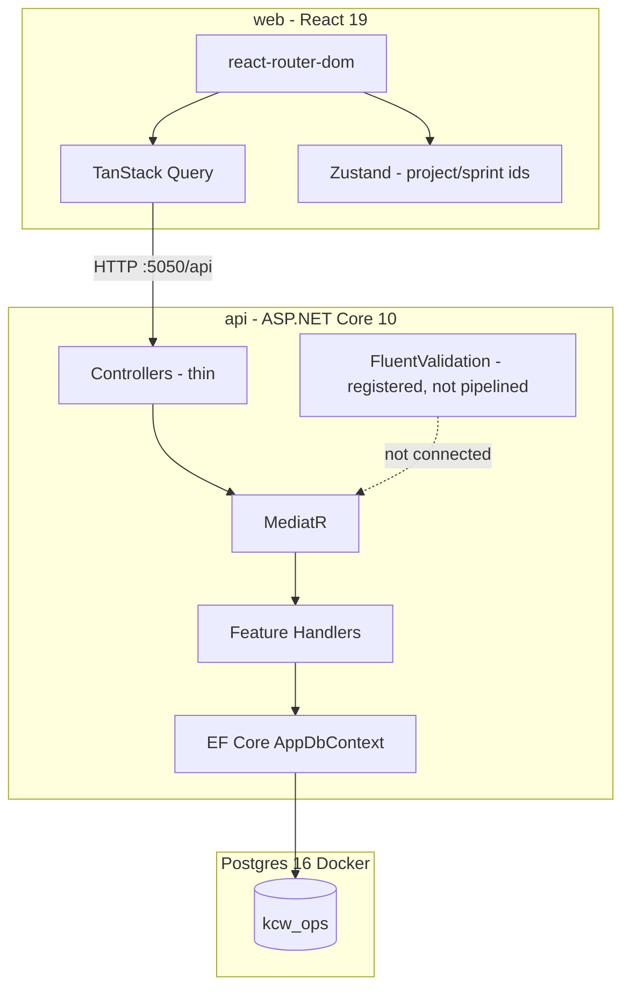
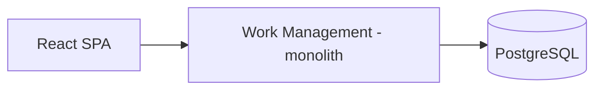

# kcw / ops — Principal Engineer Codebase Audit

**Date:** 2026-05-20 (Phase 1 baseline) — **updated 2026-05-21**
**Scope:** Full stack (`api/`, `web/`, `docs/`, infra)  
**Auditor lens:** Domain-driven design (strategic), **vertical slice architecture**, CQRS, and pragmatic “modern modular monolith” engineering

## Resolved since this audit (Phases 2–4)

| Finding | Resolution |
|---------|-----------|
| P3 — Delete story missing | ✅ `DeleteStory` slice added |
| P3 — Sprint lifecycle missing | ✅ `StartSprint`, `CompleteSprint`, `DeleteSprint` added |
| P3 — Activity / comments / users missing | ✅ Phase 4 complete — `User`, `Comment`, `ActivityEvent` entities; full API + UI |
| P3 — No error boundaries | ✅ `ErrorBoundary` wraps `<Outlet />` in `AppShell` |
| P3 — Kanban “Loading sprint…” forever | ✅ Empty-sprints state added |
| Audit note — “re-run after Phase 2” | Codebase is now at Phase 4 complete; re-run recommended before Phase 5 (auth) |

Remaining open items from this audit (P0–P2) are still valid: FluentValidation pipeline, `ProblemDetails` middleware, unique indexes, `VITE_API_URL` env var.

---

## Executive summary

This codebase is a **well-scoped personal PM tool** in active build-out (~38 C# files, ~31 TS/TSX files in `web/src`). It is **intentionally not a textbook DDD implementation** — and that is appropriate for the current phase. What you have instead is a **clean vertical-slice + CQRS layout** that matches `CLAUDE.md` and `BUILD_PLAN.md` more closely than classic layered DDD.

**Overall grade: B+ for architecture intent, C+ for production hardening.**

| Area | Verdict |
|------|---------|
| Vertical slices + MediatR | Strong alignment |
| Strategic DDD (bounded contexts, ubiquitous language) | Good domain model, light on explicit boundaries |
| Tactical DDD (aggregates, repositories, domain events) | Deliberately absent — consistent with VSA |
| Frontend data/routing split | Strong (URL + TanStack Query + minimal Zustand) |
| Validation & error contracts | **Gap — validators exist but are not executed** |
| Tests, CI, observability | Not started |
| Schema constraints & concurrency | Thin — acceptable for solo dev, risky at scale |

The highest-impact fix before Phase 2 views is **wiring FluentValidation into the MediatR pipeline**. The highest-impact structural cleanup is **removing duplicate Shadcn artifacts** under `web/@/`.

---

## Terminology: what is the “new modern style”?

You likely mean one or more of these (they overlap in practice):

| Term | What it means here |
|------|-------------------|
| **Vertical Slice Architecture (VSA)** | Organize by *use case* (`Features/Stories/UpdateStory/`), not by technical layer (`Repositories/`, `Services/`). Each slice owns HTTP shape, validation, handler, and persistence for one capability. |
| **CQRS** | Commands mutate (`CreateStory`, `UpdateStory`); queries read (`GetStories`). Handlers do not mix read graphs with writes. |
| **Pragmatic / transaction-script handlers** | Handlers talk to `AppDbContext` directly — no repository interfaces, no aggregate roots. This is the style Jimmy Bogard and others advocate for most apps *until* complexity forces richer domain logic. |
| **Modular monolith** | Single deployable API + DB; boundaries are folder/module discipline, not microservices. |

**Contrast with classic DDD (circa 2000s–2010s “layered” style):**

- Application services orchestrating repositories
- Rich domain models with invariants enforced in entities
- Domain events, specifications, anti-corruption layers everywhere

Your repo **documents VSA + CQRS** in `CLAUDE.md` and **implements it** in `api/Features/`. That is the modern default for greenfield .NET APIs in 2024–2026, especially before complexity warrants full tactical DDD.

Related names you might hear: **“feature folders”**, **“use-case driven design”**, **“REPR”** (Request–Endpoint–Response pattern with minimal controllers). You are already doing REPR via thin controllers + MediatR.

---

## Architecture map



**Dependency rule (observed):** `Controllers → MediatR → Handlers → DbContext → Domain entities`. No inward dependency violations. `Domain/` is persistence-friendly POCOs, not a isolated domain layer.

---

## Backend audit

### What is working well

1. **Vertical slices are real, not cosmetic.** Story workflows live under `api/Features/Stories/{UseCase}/` with colocated commands, handlers, and validators. Reads and writes are separated (`GetStoriesHandler` vs `UpdateStoryHandler`).

2. **Thin controllers.** `StoriesController` delegates entirely to MediatR; HTTP concerns stay at the edge. This matches REPR/VSA guidance.

3. **Projection mapping is explicit.** `StoryMapper` and handler `Select` projections keep DTO shape out of entities. `GetProgramsHandler` projects in LINQ — efficient read path.

4. **Business rules in handlers are readable.** Cross-entity checks (epic/sprint belong to project) use clear `InvalidOperationException` messages; Fibonacci and enum parsing live in `StoryEnums`.

5. **Sort order model is sound.** `SortOrder` with gaps of 1000, `ReorderStories` batch update, and Kanban optimistic updates are a coherent vertical feature end-to-end.

6. **Dev ergonomics.** Migrate + seed on startup in Development keeps local iteration fast.

### Gaps and risks

#### P0 — FluentValidation is registered but never runs

`Program.cs` calls `AddValidatorsFromAssembly`, and `CreateStoryValidator` / `UpdateStoryValidator` exist — but there is **no** `IPipelineBehavior` (or MediatR validation behavior) and **no** `AddFluentValidationAutoValidation` for controllers.

**Impact:** Invalid Fibonacci points, bad statuses, or oversized titles can reach handlers. Some rules are duplicated in handlers; others only exist in validators.

**Recommendation:** Add a single `ValidationBehavior<TRequest,TResponse>` that runs all `IValidator<TRequest>` before handlers. Keep controllers thin; fail fast with `400` + problem details.

#### P1 — No global error shape

Handlers throw `InvalidOperationException`; controllers catch and return `{ error: string }`. There is no:

- RFC 7807 `ProblemDetails`
- Consistent validation error payload
- Correlation / trace id

Frontend `client.ts` only reads `err.error` on failures — works today, brittle as slices multiply.

#### P1 — Schema lacks uniqueness and concurrency guards

From migrations:

- No **unique** index on `(ProjectId, Number)` for human-readable IDs (`AUTH-247`).
- No **unique** index on `Project.Key`.
- No row version / concurrency token on `Story`.

`CreateStoryHandler` uses `Max(Number) + 1` — two concurrent creates can collide.

#### P2 — EF configurations are a no-op

`AppDbContext` calls `ApplyConfigurationsFromAssembly`, but **no** `IEntityTypeConfiguration<>` classes exist. Everything relies on conventions:

- `Program_` renamed table only by convention? (class name `Program_` avoids keyword — table is `Programs` ✓)
- Cascade deletes on project delete may be harsher than product intent
- No explicit enum-to-string storage (ints in DB — fine, but document it)

#### P2 — Anemic domain (by design, but know the tradeoff)

`Domain/Entities.cs` are property bags. Invariants live in handlers:

- Pros: fast to build, easy to read, fits VSA
- Cons: rules scatter as features grow; harder to unit-test “the Story aggregate” without DB

**When to add richness:** If you introduce workflow engines, cross-story invariants, or event sourcing — not before Phase 2.

#### P3 — Missing slices (expected per BUILD_PLAN)

| Capability | Status |
|------------|--------|
| Delete story | Missing |
| Sprint lifecycle commands | Missing |
| Activity / comments / users | Missing |
| AuthN/Z | `UseAuthorization()` with no auth scheme |
| Pagination / filtering | Full list per project/sprint |

#### P3 — `ReorderStories` has no validator

Command accepts raw status string and ID list; handler validates — OK — but inconsistent with other story commands that have FluentValidation types.

#### P4 — Date format inconsistency in API

`StoryMapper.ToDto` formats `DueDate` as `"MMM d"` for list cards; `ToDetailDto` uses `"yyyy-MM-dd"`. Clients must handle two formats for the same field depending on endpoint.

---

## Frontend audit

### What is working well

1. **State ownership is correct.** Server state → TanStack Query; URL → `react-router-dom` (`projectKey`, view segment, `?sprint=`, `?story=`); Zustand only mirrors `activeProjectId` / `activeSprintId` synced from URL in `AppShell`.

2. **Optimistic updates are implemented** for `useUpdateStory` and `useReorderStories` with rollback on error — appropriate for Kanban UX.

3. **DnD architecture is capable.** `@dnd-kit` with activation distance preserves click-to-open-drawer; cross-column drag triggers status PATCH then column reorder — matches API design.

4. **Route helpers are centralized.** `lib/routes.ts` + `useAppNavigate` reduce stringly-typed navigation bugs.

5. **Types mirror API DTOs** in `web/src/types/index.ts` with shared Fibonacci and status unions.

### Gaps and risks

#### P1 — Duplicate Shadcn tree: `web/@/components/ui/`

There is a full duplicate of UI primitives under `web/@/` while the app imports from `web/src/components/ui/`. Vite alias `@` → `./src`, so **`web/@/` is dead weight** and will confuse future `npx shadcn` adds.

**Recommendation:** Delete `web/@/` after confirming nothing imports it.

#### P1 — Inline styles dominate product UI

Kanban, Sidebar, TopBar, StoryDrawer use extensive `style={{ ... }}` with CSS variables — faithful to the HTML prototype but **underuses Tailwind + Shadcn** stated in `CLAUDE.md`. `command.tsx` exists; ⌘K palette not wired.

#### P2 — Drawer component mismatch

`CLAUDE.md` specifies Shadcn `Sheet` (720–920px). Implementation uses `Dialog` in `StoryDrawer.tsx`. Functional, but diverges from design system intent and focus-trap patterns for side panels.

#### P2 — Hardcoded API base URL

`client.ts`: `const BASE = 'http://localhost:5050/api'`. Phase 5 / production will need `import.meta.env.VITE_API_URL`.

#### P3 — `AppShell` effect graph is dense

Multiple `useEffect` hooks coordinate project resolution, sprint defaulting, and URL rewrites. Works, but is a future bug nest when adding auth guards or loading states. Consider a small `useProjectRoute()` hook or router loader (React Router 7 data APIs).

#### P3 — No error boundaries or route-level suspense

BUILD_PLAN Phase 3.2 lists these as open — still accurate.

#### P4 — Deprecated type still exported

`View` type in `types/index.ts` marked `@deprecated` in favor of `AppView` — good hygiene; remove when callers are gone.

---

## Strategic DDD assessment

### Ubiquitous language

Strong alignment between docs, API enums, and UI:

- Program → Project → Epic → Sprint → Story
- Backlog = `SprintId == null`
- Status / priority strings match design (`todo`, `progress`, …)

### Bounded contexts

**Single context today:** “Work management” for engineering delivery. No separate billing, identity, or notification contexts — correct for scope.

**Potential future splits** (only when needed):

| Context | Trigger |
|---------|---------|
| Identity & access | Phase 5 auth |
| Activity / notifications | Phase 4 feed |
| Planning / capacity | Sprint planning surface |

Keep them as **folders/modules** inside the monolith until integration pain appears.

### Context map (current)



---

## CQRS consistency check

| Rule (from CLAUDE.md) | Compliance |
|-------------------------|------------|
| Commands mutate | ✅ Handlers call `SaveChangesAsync` |
| Queries read | ✅ No saves in Get* handlers |
| Writes don’t return heavy graphs | ✅ Returns `StoryDetailDto`, not entity graphs |
| Reads don’t mutate | ✅ |

**Minor drift:** `UpdateStoryHandler` reloads navigation properties after save — still a write handler returning a read DTO; acceptable pattern.

---

## Data model & persistence

### Entity graph

Matches documented hierarchy. Notable fields:

- `Story.Number` — monotonic per project
- `Story.SortOrder` — per (project, sprint|null, status) column
- `Labels` — PostgreSQL `text[]` (good use of Npgsql)

### Missing indexes (recommended)

```sql
-- Illustrative; add via EF configuration + migration
UNIQUE (ProjectId, Number)
UNIQUE (Key) on Projects  -- or (ProgramId, Key) if keys repeat across programs
INDEX (ProjectId, SprintId, Status, SortOrder)  -- board query hot path
```

### Seeding

`DataSeeder` is comprehensive fictional data — appropriate for public repo rules. Sort order seeding by status is thoughtful.

---

## Security & operations

| Topic | Status |
|-------|--------|
| Authentication | Not implemented; all endpoints open |
| CORS | Locked to `localhost:5175` in dev |
| Secrets in repo | Docker password `kcw_local` — acceptable for local-only |
| CI/CD | No `.github/workflows` |
| Tests | No test projects |
| OpenAPI | Mapped in Development only — good for iteration |
| Container orchestration | Postgres only; API + web run on host |

---

## Alignment with BUILD_PLAN

Phases 0–1 (interactive core) are largely delivered:

- Story CRUD + reorder API ✅
- Kanban DnD + drawer + routing ✅
- Placeholder views for Phase 2 ✅

Audit confirms BUILD_PLAN is an accurate living doc. Suggested doc tweak: note **FluentValidation wiring** as a Phase 1.1 exit criterion before expanding write surfaces.

---

## Prioritized recommendations

### Do now (before Phase 2)

1. **Wire MediatR validation pipeline** for all commands.
2. **Add unique constraint** `(ProjectId, Number)` and handle conflict on create.
3. **Delete `web/@/`** duplicate components.
4. **Standardize `DueDate`** to ISO `yyyy-MM-dd` in all DTOs.
5. **Introduce `ProblemDetails`** middleware for exceptions + validation failures.

### Do during Phase 2

6. Extract **`useProjectRoute`** (or router loaders) from `AppShell` effects.
7. Add **integration tests** for story create/update/reorder invariants (Fibonacci, epic ownership).
8. Add **EF configurations** for indexes and delete behaviors.
9. Replace **ViewPlaceholder** views incrementally; keep route table stable.

### Do before production (Phase 6)

10. CI: `dotnet test`, `npm run build`, eslint.
11. E2E: Playwright for `/p/AUTH/board`, `?story=`, DnD, browser back.
12. Env-based API URL; Docker Compose for api + web + db.
13. Pagination on `GET /api/stories` when card count > ~200.

### Do only if complexity demands (DDD tactical)

14. Extract `Story` invariant methods (`AssignToSprint`, `MoveToStatus`) when rules duplicate across 4+ handlers.
15. Introduce **domain events** when Activity feed needs reliable “what changed” (Phase 4).

---

## File reference (audit anchors)

| Concern | Path |
|---------|------|
| Composition root | `api/Program.cs` |
| Entities | `api/Domain/Entities.cs` |
| Story slices | `api/Features/Stories/` |
| HTTP edge | `api/Controllers/StoriesController.cs` |
| Routing | `web/src/App.tsx`, `web/src/lib/routes.ts` |
| URL ↔ store sync | `web/src/components/layout/AppShell.tsx` |
| Server state | `web/src/api/stories.ts` |
| Kanban / DnD | `web/src/components/kanban/Kanban.tsx` |
| Roadmap | `docs/BUILD_PLAN.md` |

---

## Conclusion

You are building in the **right architectural lane**: vertical slices, CQRS, modular monolith, URL-first React. That is the modern alternative to heavyweight layered DDD for a product at this maturity.

The codebase is **coherent and shippable for solo use** but **not yet production-hardened**. The single most important technical debt is **validators that never run**; the single most important structural debt is **duplicate UI files and inline-style drift from the Shadcn/Tailwind target**.

Treat tactical DDD (aggregates, repositories, events) as **optional escalation paths**, not prerequisites — your docs already imply this; the implementation matches.

---

*This audit is a point-in-time snapshot. Re-run after Phase 2 (backlog/planning/list) or when auth lands.*
